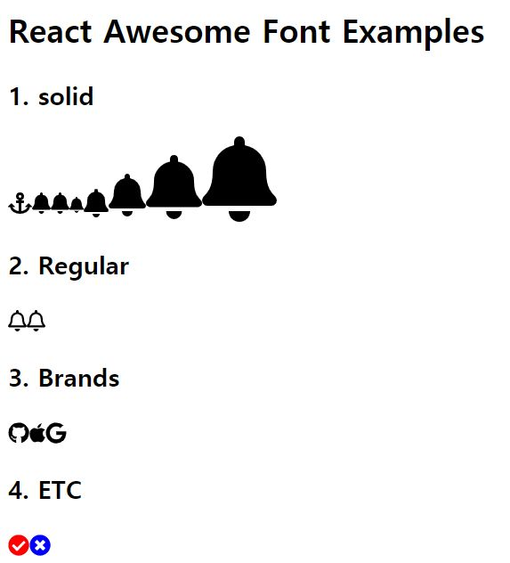

# Component - Component Styling

## Learn what

### 01. Inline Styling (:star:)
* [src/01](src/01)
* Usage
    ```bash
    npm run debug src=01
    ```
* inline styling ([src/01/App.js](src/01/App.js))
    ```js
    import React from 'react';

    export default function App(){
        const h1Styles = {
            width: 120,
            height: 200,
            padding: 5,
            color: '#fff',
            backgroundColor: '#ee9900'
        };
        return (
            <div id='App'>
                <h1 style={h1Styles}>Inline Styling</h1>
            </div>
        );
    }
    ```

### 02. Normal CSS (css-loader options{ modules: false }) : 잘 안씀
* [src/02](src/02)
* Usage
    ```bash
    npm run debug src=02 css-modules=false
    ```

### 03. Normal CSS (css-loader options{ modules: true }) 
### 04. CSS Module (css-loader options{ modules: true }) (:star:)
### 05. CSS in JS (:star:)
### 06. Styled Component (:star:)
### 07. SASS & SCSS (:star:)
### 08. LESS & Stylable (:star:)
### 09. Awesome Font

* [Awesome Font  Web Site](https://fontawesome.com/)

* Awesome Font(React) 
    * 설치
        * (필수)core 설치
            ```bash
            npm i @fortawesome/fontawesome-svg-core
            npm i @fortawesome/react-fontawesome
            ```
        * (선택)font 종류
            * icons
                * light : 유료
                * solid : 기본, 多 사용
                * regular
                * brand : Apple, Facebook mark등등 기업 폰트 적용
            ```bash
            npm i @fortawesome/free-solid-svg-icons
            npm i @fortawesome/free-regular-svg-icons
            npm i @fortawesome/free-brands-svg-icons
            ```
    * use ([src/09](src/09/App.js))
        * React Awesome 사용
            ```js
            import { FontAwesomeIcon } from '@fortawesome/react-fontawesome';
            ```
        * solid 사용
            * fa, fas
            ```js
            import { faBell } from '@fortawesome/free-solid-svg-icons';
            ```
        * regular 사용
            * far
            ```js
            import { faBell as farBell } from '@fortawesome/free-regular-svg-icons';
            ```
        * brand 사용
            * fab
            ```js
            import { fab } from '@fortawesome/free-brands-svg-icons';
            ```
    * result

        

### 10. React Modal (src/08)

### 11. material-UI (src/09)

## project

* basic/ex08의 package.json, package-lock.json 복사
    * module 설치 : ```npm i```

* scripts (package.json)
    ```json
    "scripts": {
        "build": "npx webpack --mode production",
        "debug": "npx webpack server --progress --mode development --env"
    },
    ```
    * env : env줘서 원하는 예제 source 실행 가능
* config
    * [webpack.config.js](webpack.config.js)
        * env 변수 입력받음 -> 함수화
        * css-loader : ```{ loader: "css-loader", options: { modules: env['css-modules'] !== 'false' } }```


## (Useage)Run Examples

```bash
npm run debug src={no} css-modules=false
```
* src의 01예제 실행하고 싶은 경우 : ```npm run debug src=01```
 