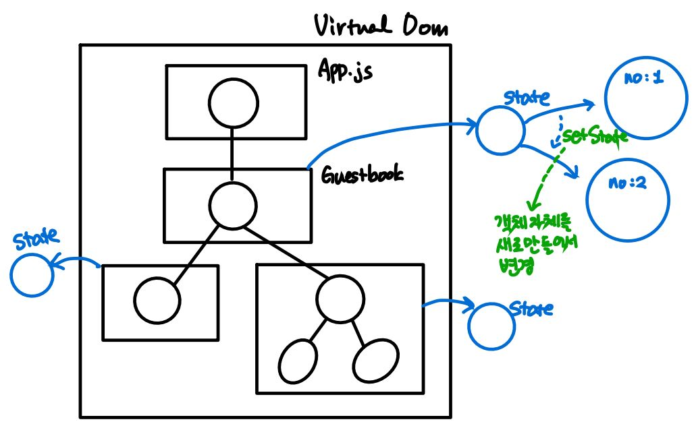

# ex03: Component - React Event

## Learn What

### 01. src/01: Inline Handler

### 02. src/02: Functional Handler 

* TitleBar01 : Functional Handler(Class Component)
    * class component : use 'this' 多
    * state 사용

        
        * setState
            * state 변경시 사용
            * functional 사고 : 객체의 내용을 바꾸는 것이 아닌 새로운 객체를 만들어서 가리키게 함
* TitleBar02 : Functional Handler(Functional Component)
    * function component : not use 'this'
    * state
        * useState : hook function

### 03. src/03: SyntheticEvent


### 04. src/04: 다양한 Event.... & ref 사용 (hook 사용 : useRef)

* mouse
    * down up click 한 세트

* bad code
    * 제어 : 사용자가 뭔가 했을때 component data를 바로 바꿀 수 있게 하는 것
        ```js
        const onKeyPressInput = function(e){
            // enter 치면 출력
            if(e.key == 'Enter'){
                console.log('onKeyPressInput');
                e.target.value = '';            // bad
            }
        }
        ```
* good code
    * 제어 : component data는 state내에서만 변경할 수 있도록 함

* offset
    * offset : Virtual DOM에서는 못구함(root node가 없기 때문)
    * Real DOM에 ref 걸어서 구할 수 있음

* ref
    * 매핑되는 Real DOM element 접근가능하게 함

### 05. src/05: Event Handler Using 'ref' I     (Functional Component) 

* scroll event
    * css
        ```css
        body    { font:0.75em "맑은 고딕", 돋움, 굴림; text-align:center; overflow-y: hidden }
        :global(.App)   { height: 100vh; width:100%; margin:0 auto; overflow-y: scroll }
        ```
        * ```vh```: Body에 딱 붙게 해줌
        * ```overflow-y```
            * body는 없애고, Virtual DOM에서 Body에 해당하는 App에 scroll 줌

### 06. src/06: Event Handler Using 'ref' II    (Class Component)

## Usage
```bash
$ npm run debug src={no}
```
* ex : ```npm run debug src=01```