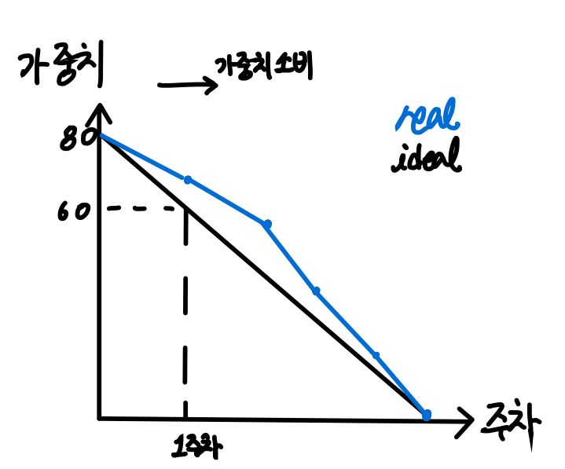
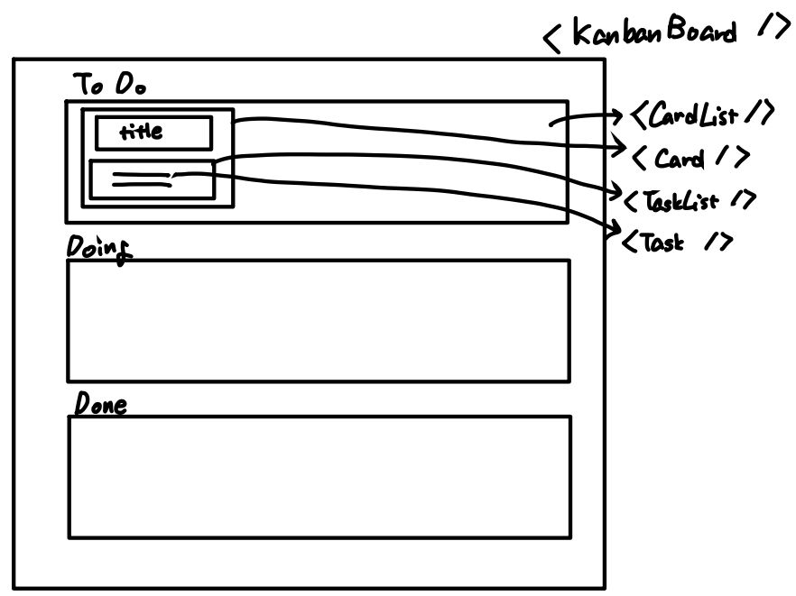
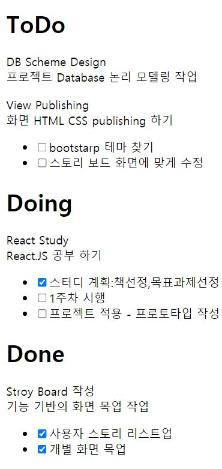
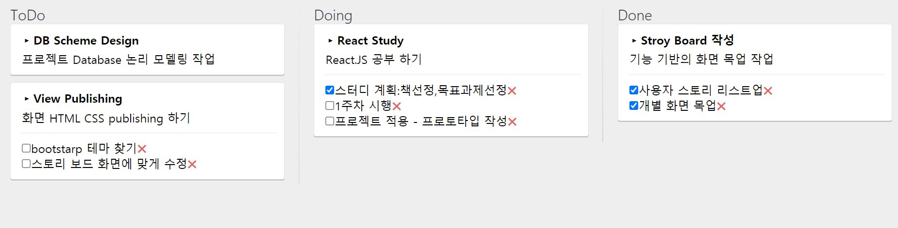

# Kanban Board

* Methodology
    * Waterfall

        

        * 문제점
            * 과정마다 항상 문제가 생김
            * 일정이 미루어질 수 있음
    * Agile
        * Kanban board

            
            
            * story board 하나 짜놓은 것으로 ToDo list 작성
                * To do list : task마다 가중치 부여
                * project 진행 과정 

                    

            * Trello 많이 사용
        * 장점
            * 기간에 대해 불만 X
        * 문제점
            * 중간에 어디까지 했는지 확인이 어려움 -> CI tool 필요함
            * 해결
                * CI tool 필요
                    * Jenkins - 고객이 바로바로 어떻게 구현했는지 test용으로 볼 수 있게 하는 것 필요
                * TDD 필요

## Project

* dependency
    ```json
     "devDependencies": {
        "@babel/cli": "^7.14.8",
        "@babel/core": "^7.14.8",
        "@babel/preset-env": "^7.14.8",
        "@babel/preset-react": "^7.14.5",
        "babel-loader": "^8.2.2",
        "css-loader": "^6.2.0",
        "file-loader": "^6.2.0",
        "style-loader": "^3.2.1",
        "webpack": "^5.46.0",
        "webpack-cli": "^4.7.2",
        "webpack-dev-server": "^3.11.2"
    },
    "dependencies": {
        "react": "^17.0.2",
        "react-dom": "^17.0.2"
    }
    ```
* src

    * ex01
        * component 작성
            * component

                

                * KanbanBoard.js -> CardList.js -> Card.js -> TaskList.js -> Task.js
        * result

            

    * ex02
        * styling module : css 모듈화
        * use
            * import
                ```js
                import styles from '../assets/css/Card.css';
                ```
            * use
                ```js
                <div className={styles.Card}>
                ```
        * result

            

## Usage

```bash
npm run debug src={src_no}
```
* ex : ```npm run debug src=ex02```